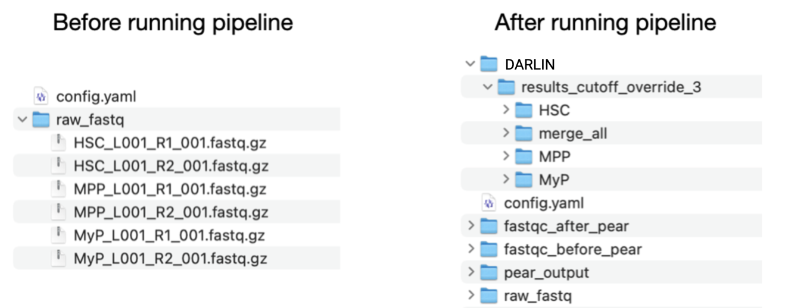
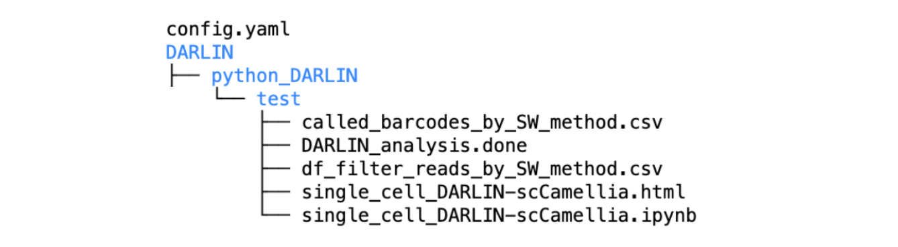
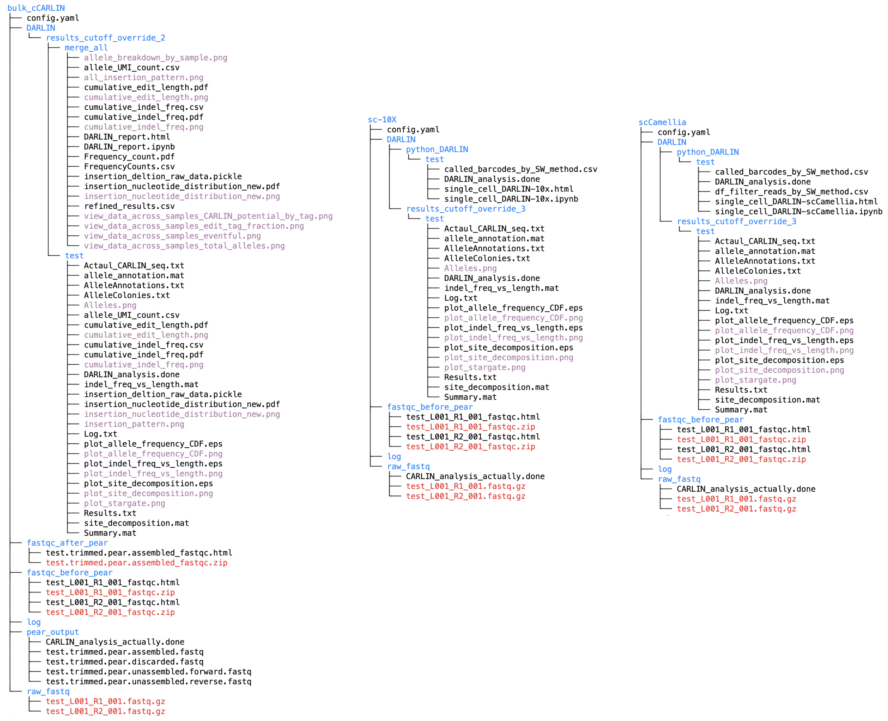
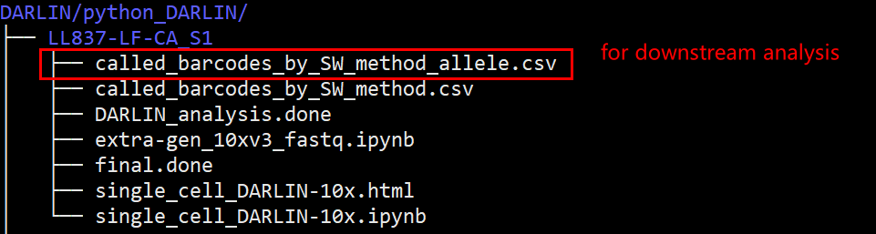

# DARLIN

This is a Snakemake pipeline to automatically preprocess data (e.g., run PEAR to merge R1 and R2), conduct sequence quality control, and run the CARLIN pipeline. It is especially useful when you have multiple samples from a single sequencing run. This is developed through the DARLIN project [L. Li,...,S.-W. Wang, F. Camargo, Cell (2023)](https://doi.org/10.1016/j.cell.2023.09.019).

Note that this pipeline must be used with a customized version of the [CARLIN pipeline](https://github.com/ShouWenWang-Lab/Custom_CARLIN), which we adapted from the original software to deal with several different DARLIN references in the CA, TA, and RA loci respectively.

## Installation

First, make a conda environment:

```bash
kernel_name='snakemake_darlin'
conda create -n $kernel_name python=3.9 --yes
conda activate $kernel_name
conda install -c conda-forge mamba --yes
mamba install -c conda-forge -c bioconda  snakemake=7.24.0 --yes
pip install --user ipykernel
pip install jupyterlab umi_tools seaborn papermill biopython
python -m ipykernel install --user --name=$kernel_name
```

Next, go to a directory where you want to store the code and install all relevant packages

```bash
code_directory='.' # change it to the directory where you want to put the packages
cd $code_directory

git clone https://github.com/ShouWenWang-Lab/snakemake_DARLIN --depth=1
cd snakemake_DARLIN
python setup.py develop
cd ..

mkdir CARLIN_pipeline
cd CARLIN_pipeline
git clone https://github.com/ShouWenWang-Lab/Custom_CARLIN --depth=1
```

Finally, you need to install [pear](https://www.h-its.org/downloads/pear-academic/) and MATLAB. It is often needed to install pear on a HPC locally so that no root permission is needed. To do so, you can use `./configure --prefix /local/directory` to install it locally where you do have access. Below is an example script for installing pear on HPC locally.
```bash
cd pear_installation_folder
./configure --prefix ~ # install at the local home directory
make
make install
```


MATLAB should be available in the command line interface. In an HPC environment, MATLAB can be loaded with the command:
```bash
module load matlab
```
MATLAB should have Bioinformatics Toolbox and Image Processing Toolbox addons installed. FastQC and MultiQC should also be available from the command line, otherwise you will not get the QC report (however, you can finish the DARLIN preprocessing without them).


This pipeline also use `fastqc` and `multiqc` to visualize sequence quality. The pipeline should run correctly even without them. But if you want to see the QC results, please have these two commands available in the terminal. 


## Usage

The pipeline assumes that it is being called on a server with SLURM if `sbatch=1` in the config file (see below). If not, you can copy-and-paste the generated command and run it locally.

With `sbatch=0`, it should run properly in a normal Linux system without SLURM. However, it cannot submit jobs and run them in parallel in this case.

### File structure



As indicated in the above example, the `config.yaml` file should be at the root folder of a project, and the fastq data should be at the folder `raw_fastq`.

We assume that the data is generated with Miseq machine from Illumina. Specifically, we assume that the file name starts with a sample_ID, and has both R1 and R2:

```python
fq_R1=f"{sample}_L001_R1_001.fastq.gz"
fq_R2=f"{sample}_L001_R2_001.fastq.gz"
```

Please rename the files if they are not in this format. An example of `config.yaml` file is as follows:

```yaml
project_name : 'Li_112219'
project_ID : '144505366'
SampleList : ['HSC','MPP','MyP'] #Remove 1_S*, it will have few reads, affect the output
cfg_type : 'sc10xV3' # available protocol: BulkRNA_Tigre_14UMI, BulkRNA_Rosa_14UMI, BulkRNA_12UMI, scCamellia,sc10xV3
template : 'cCARLIN' # short_primer_set: {Tigre_2022_v2, Rosa_v2, cCARLIN}, long_primer_set: {Tigre_2022,Rosa,cCARLIN}
read_cutoff_UMI_override : [3,10] # assume to be a list, UMI cutoff is the same as CB cutoff for single-cell protocol
CARLIN_memory_factor : 300 # request memory at X times the size of the pear fastq file.
sbatch : 1 # 1, run sbatch job;  0, run in the interactive mode. 
CARLIN_max_run_time : 12 # hour
```

`code_directory` should be the same directory where you clone the code. 

`SampleList` should be the list of samples that you want to analyze. 

`cfg_type` should match the protocol of the experiment. Some of the provided protocols include:

 * `BulkRNA_Tigre_14UMI`: Bulk CARLIN library with Tigre locus, with a UMI of 14bp
 * `BulkRNA_Rosa_14UMI`:  Bulk CARLIN library with Rosa locus, with a UMI of 14bp
 * `BulkRNA_12UMI`: Bulk CARLIN library with Col1a1 locus, with a UMI of 12bp
 * `scCamellia`: Single-cell CARLIN library using the scCamellia-seq protocol
 * `sc10xV3`: Single-cell CARLIN library using the 10X v3 protocol

 `template` should match the primer set used. We have template corresponding to shorter primers in TC and RC: {`Tigre_2022_v2`, `Rosa_v2`}, and longer primers: {`Tigre_2022`, `Rosa`}. For Col1a1 locus, we only have a single primer set, corresponding to tempalte `cCARLIN`.

`read_cutoff_UMI_override`: minimum number of reads needed to support a UMI (bulk library) or a cell barcode (single cell library). It should be a list of read cutoff like [3,10].

`CARLIN_memory_factor`: When running on o2, the requested memory should be `CARLIN_memory_factor` times the fastq file size.

`sbatch`: when running on o2, whether to run with sbatch jobs (1) or in interactive mode (0).

`CARLIN_max_run_time`: When running on o2, the maximum run time to request, in the unit of hours.

### Getting data from base space

When the fastq files are not downloaded yet in the `raw_fastq` folder, and the data sits at base space of Illumina, you can provide `project_name` and `project_ID` in `config.yaml` to automaically download the data.

First, check the available fastq data with the terminal command:

```bash
bs auth # this needs to be done only once for authentification
bs list project
```


Next, select the desired project name and ID. In the above `config.yaml` file, we selected the data from the first entry.

Next, activate the correct environment
```bash
conda activate snakemake_darlin # activate the environment
```
and run the snakemake script at the same directory as the `config.yaml` file:

```bash
snakemake -s $code_directory/snakemake_DARLIN/snakefiles/snakefile_get_data.py --configfile config.yaml --core 1
```

### Matlab-based DARLIN analsysis for both bulk and single-cell libraries

This command will generate the QC report and process each sample with the CARLIN pipeline:

```bash
snakemake -s $code_directory/packages/snakemake_DARLIN/snakefiles/snakefile_matlab_DARLIN_Part1.py  --configfile config.yaml --core 10
```

Finally, you may run this command to get an html report across all samples:

```bash
snakemake -s $code_directory/packages/snakemake_DARLIN/snakefiles/snakefile_matlab_DARLIN_Part2.py --configfile config.yaml --core 5 --ri -R generate_report -R plots 
```

The result will show up at the `merge_all` folder as shown in the above image. 

### A fast, python-based DARLIN analysis for single-cell libraries 

We also developed a fast, python-based pipeline for processing single-cell DARLIN data.It is much faster than the CARLIN pipeline written in Matlab, and is written in python so that it is freely available and the Matlab installation is not required. This is particularly useful for single-cell libraries with higher amplification heterogeneity, e.g., one cell gets 10K reads, while another cell only has 10 reads. We execute a jupyter notebook (`QC/single_cell_DARLIN-10x.ipynb` or `QC/single_cell_DARLIN-scCamellia.ipynb`) to obtain the results and also quality control plots simultaneously.

To run this, you need to setup a proper environment, which we may call `DARLIN_analysis`. Particulary, it requires our in-house package called `MosaicLineage` as well as `cospar`

```bash
code_directory='.' # change it to the directory where you want to put the packages
cd $code_directory
kernel_name='DARLIN_analysis'
conda create -n $kernel_name python=3.8 --yes
conda activate $kernel_name
pip install cospar
pip install --user ipykernel
pip install pytest black ipywidgets
pip install pytest-datadir pytest-cov umi_tools toolz jupyterlab pyyaml scikit-bio biopython  wand  seaborn==0.11.2  scikit-learn==1.1.1 pandas==1.5.3
python -m ipykernel install --user --name=$kernel_name
pip uninstall cospar # uninstall the old version, and install the latest
cd $code_directory
git clone https://github.com/ShouWenWang-Lab/cospar --depth=1
cd cospar
python setup.py develop
cd $code_directory
git clone https://github.com/ShouWenWang-Lab/MosaicLineage --depth=1
cd MosaicLineage
python setup.py develop
cd $code_directory
git clone https://github.com/ShouWenWang-Lab/snakemake_DARLIN --depth=1
cd snakemake_DARLIN
python setup.py develop
```

Then, you need to add more parameters in the `config.yaml` file:

```yaml
project_name : 'Li_112219'
project_ID : '144505366'
SampleList : ['HSC','MPP','MyP'] #Remove 1_S*, it will have few reads, affect the output
cfg_type : 'sc10xV3' # available protocol: BulkRNA_Tigre_14UMI, BulkRNA_Rosa_14UMI, BulkRNA_12UMI, scCamellia,sc10xV3
template : 'cCARLIN' # short_primer_set: {Tigre_2022_v2, Rosa_v2, cCARLIN}, long_primer_set: {Tigre_2022,Rosa,cCARLIN}
read_cutoff_UMI_override : [3,10] # assume to be a list, UMI cutoff is the same as CB cutoff for single-cell protocol
CARLIN_memory_factor : 300 # request memory at X times the size of the pear fastq file.
sbatch : 1 # 1, run sbatch job;  0, run in the interactive mode. 
CARLIN_max_run_time : 12 # hour
python_DARLIN_pipeline: # This is an extension, needed only if you run snakefile_single_cell_DARLIN.py
    min_reads_per_allele_group: 5 # the lower bound of the later read count filtering, after denoising, and re-group reads. 
    distance_relative_threshold: 0.03 # 5% error rate, will be multipled with the sequence length
    read_ratio_threshold: 0.6
    seq_3prime_upper_N: 15
    output_folder: 'python_DARLIN'
    kernel: 'DARLIN_analysis'
```

Finally, run:

```bash
snakemake -s $code_directory/packages/snakemake_DARLIN/snakefiles/snakefile_python_DARLIN.py  --configfile config.yaml --core 10
```

The result will show up as a jupyter notebook and a corresponding html report:



### Test
To test if the pipeline has been installed correctly, please go to the `test` folder and run the command
```bash
bash test.sh
```

If everything goes correctly, the expected output for the three test datasets should be like this:


A log file for running this test module is available to download at [here](https://github.com/ShouWenWang-Lab/snakemake_DARLIN/files/14940946/log.txt).

### DARLIN analysis together with allele information

#### For 10x

Parameters in the `config-CA.yaml` file:

```yaml
project_name : 'LL835_10X_3A'
project_ID : '359277919'
SampleList : ['LL837-LF-CA_S1'] #DO NOT include 1_S*, it will have few reads, affect the output ['test_RC'] #
cfg_type : 'sc10xV3'  # used_cfg_type: {BulkRNA_Tigre_14UMI, BulkRNA_Rosa_14UMI, BulkRNA_12UMI, scCamellia,sc10xV3};  # our bulk DNA and RNA protocol results in the same sequence structure, and share common cfg file
template : 'cCARLIN' # short_primer_set: {Tigre_2022_v2, Rosa_v2, cCARLIN}, long_primer_set: {Tigre_2022,Rosa,cCARLIN}
read_cutoff_UMI_override : [1] # assume to be a list, UMI cutoff is the same as CB cutoff for single-cell protocol
CARLIN_memory_factor : 300 # request memory at X times the size of the pear fastq file.
sbatch : 0 # 1, run sbatch job;  0, run in the interactive mode. If set to be 1, expect error from file latency, as the sbatch job would take a while to finish
CARLIN_max_run_time : 6 # hour
python_DARLIN_pipeline:
    min_reads_per_allele_group: 5 # the lower bound of the later read count filtering, after denoising, and re-group reads. 
    distance_relative_threshold: 0.03 # 5% error rate, will be multipled with the sequence length
    read_ratio_threshold: 0.6
    seq_3prime_upper_N: 15
    output_folder: 'python_DARLIN'
    kernel: 'DARLIN_analysis'
```

Finally, run:

```bash
# Extracting and denoising DARLIN sequence
snakemake -s ../../snakefiles/snakefile_python_DARLIN.py --configfile config-CA.yaml --core 5 --config sbatch=0 -R DARLIN
# Calling allele via Matlab-based DARLIN pipeline (fast)
snakemake -s ../../snakefiles/snakefile_call_mut.py --configfile config-CA.yaml --core 5 --config sbatch=0
```

The result will show up as a jupyter notebook and a corresponding html report:



#### For scCamellia

Everything is the same as in 10xv3, except for the changes made to the parameters in the `config-CA.yaml` file:

```yaml
project_name : 'scCamellia_lineage'
project_ID : '290654424'
SampleList: ['241012_Gr_CA', '241012_Mon_CA']
cfg_type : 'scCamellia' # used_cfg_type: {BulkRNA_Tigre_14UMI, BulkRNA_Rosa_14UMI, BulkRNA_12UMI, scCamellia,sc10xV3};  # our bulk DNA and RNA protocol results in the same sequence structure, and share common cfg file
template : 'cCARLIN' # short_primer_set: {Tigre_2022_v2, Rosa_v2, cCARLIN}, long_primer_set: {Tigre_2022,Rosa,cCARLIN}
read_cutoff_UMI_override : [1] # assume to be a list, UMI cutoff is the same as CB cutoff for single-cell protocol
CARLIN_memory_factor : 300 # request memory at X times the size of the pear fastq file.
sbatch : 0 # 1, run sbatch job;  0, run in the interactive mode. If set to be 1, expect error from file latency, as the sbatch job would take a while to finish
CARLIN_max_run_time : 12 # hour
python_DARLIN_pipeline:
    min_reads_per_allele_group: 5 # the lower bound of the later read count filtering, after denoising, and re-group reads. 
    distance_relative_threshold: 0.03 # 5% error rate, will be multipled with the sequence length
    read_ratio_threshold: 0.6
    seq_3prime_upper_N: 15
    output_folder: 'python_DARLIN'
    kernel: 'DARLIN_analysis'

```


## Upgrade

Active changes are being made to the github repository. If you want to incorporate the latest changes, please run
```bash
cd $code_directory
cd snakemake_DARLIN
git pull
cd ../CARLIN_pipeline/Custom_CARLIN 
git pull
cd ../../MosaicLineage
git pull
```


## Reference

L. Li, S. Bowling, S. E. McGeary, Q. Yu, B. Lemke, K. Alcedo, Y. Jia, X. Liu, M. Ferreira, A. M. Klein, S.-W. Wang*, F. D. Camargo*, [A mouse model with high clonal barcode diversity for joint lineage, transcriptomic, and epigenomic profiling in single cells, Cell (2023).](https://doi.org/10.1016/j.cell.2023.09.019) [* corresponding authors]

## External links
- A 30min video about DARLIN project in [Youtube](https://www.youtube.com/watch?v=TywIb_4cPk8) or [Bilibili](https://www.bilibili.com/video/BV1sw411F7hd/?spm_id_from=333.999.0.0&vd_source=88ba2b3e0a84657ca67330d8cba9e18f).

- [MosaicLineage](https://github.com/ShouWenWang-Lab/MosaicLineage), A (mosaic) collection of python help functions related to lineage tracing data analysis, developed through the DARLIN project.

- [Notebooks](https://github.com/ShouWenWang-Lab/DARLIN_tutorial) to reproduce Figure 4 and Figure 5 in our paper. It also illustrates how to use the MosaicLineage package there.

- [Raw and intermediate data for these notebooks](https://zenodo.org/records/11929508). To download all raw or processed data, please go to [GEO: GSE222486](https://www.ncbi.nlm.nih.gov/geo/query/acc.cgi?acc=GSE222486)

- [Shou-Wen Wang Lab website](https://www.shouwenwang-lab.com/)

